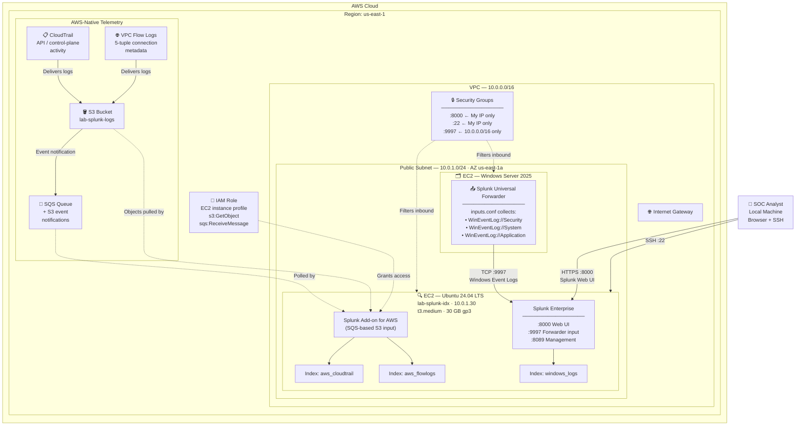

# Lab 03 — Splunk SIEM & Log Analysis on AWS
### Splunk Enterprise · EC2 · CloudTrail · VPC Flow Logs · SOC Skills


---

## Overview

This lab documents the deployment of a working Splunk SIEM on AWS EC2, ingesting log data from three distinct sources: **Windows Security Event Logs** from the Active Directory domain controller built in Lab 01, **AWS CloudTrail** (API and control-plane activity), and **VPC Flow Logs** (network connection metadata). It covers indexer deployment, forwarder configuration, SPL query writing, dashboard construction, and automated alerting.

The SIEM is the security operations centre's primary tool. When an alert fires, the analyst opens the SIEM to understand what happened, when, from where, and what was affected. Splunk remains the most widely deployed commercial SIEM, and the skills here transfer directly to **Amazon Security Lake**, **AWS Security Hub**, **Amazon OpenSearch**, and **Microsoft Sentinel** — every one of which uses the same collect → index → search → alert model.

What makes this the AWS version rather than a lift-and-shift: the lab correlates **identity events** (who logged in) with **cloud control-plane events** (what they did in AWS) and **network events** (where traffic went). That three-source correlation is what a real cloud SOC does, and it is not possible in a single-source lab.

---

## Architecture



---

## AWS Infrastructure at a Glance

| Resource | Configuration | Purpose |
|---|---|---|
| **Splunk indexer** | EC2 `t3.medium` — 2 vCPU, 4 GB RAM | Splunk requires 4 GB minimum; `t2.micro` will not run it |
| **AMI** | Ubuntu Server 24.04 LTS | Splunk `.deb` package target |
| **Storage** | 30 GB gp3 EBS | Index storage + OS |
| **Private IP** | `10.0.1.30` | Forwarder destination |
| **Domain controller** | EC2 Windows Server 2025 (Lab 01) | Log source — `10.0.1.10` |
| **S3 bucket** | `lab-splunk-logs-<account-id>` | CloudTrail + Flow Log delivery target |
| **SQS queue** | `lab-splunk-s3-notifications` | Notifies Splunk of new S3 objects |
| **IAM role** | EC2 instance profile | Grants Splunk S3 + SQS read access — no static keys |
| **Security group** | 8000/22 from My IP; 9997 from VPC CIDR | Least-privilege inbound |

> **Sizing note:** Splunk Enterprise requires **at least 4 GB RAM**. The `t2.micro` free-tier instance will fail to start Splunk. Use `t3.medium` and **stop the instance between sessions** — a stopped instance incurs only EBS storage cost (~$2.40/month for 30 GB gp3).

---

## Prerequisites

- AWS account with IAM permissions for EC2, S3, SQS, IAM, CloudTrail, and VPC
- **Lab 01 completed** — the Windows Server AD domain controller on EC2 provides the identity log source
- A free Splunk account ([splunk.com](https://www.splunk.com/en_us/download/splunk-enterprise.html)) — required to download Splunk Enterprise
- SSH client and an EC2 key pair

> If Lab 01 is not built yet, you can complete Steps 1, 4, 5, 6, and 7 using CloudTrail and VPC Flow Logs alone. The Windows Event Log searches require the AD instance.

---

## Key Concepts — Read Before Starting

**What is a SIEM?**
Security Information and Event Management — a platform that collects log data from across an entire environment and makes it searchable in one place. Its two core jobs are **correlation** (connecting events across systems to reveal patterns no single system shows) and **alerting** (automatically notifying analysts when suspicious conditions are met). Without a SIEM, you would log into each system individually and search manually.

**What is SPL — Splunk Processing Language?**
The query language for asking Splunk questions. It works as a pipeline: start with a search, then pipe results through commands that filter, transform, and visualise. Example: `index=windows_logs EventCode=4625 | stats count by Account_Name | sort -count` finds failed logins, counts them by username, and sorts highest first. Every SPL search follows the same pattern — find the events, then shape the results.

**What is a Splunk index?**
A named storage bucket where events are kept — conceptually like a database table. When you search, you specify which index with `index=name`. Separate indexes let you control retention, permissions, and storage per data source. This lab creates three: `windows_logs`, `aws_cloudtrail`, and `aws_flowlogs`.

**What is the Universal Forwarder?**
A lightweight, free Splunk agent installed on any machine whose logs you want to collect. It monitors log files and Windows Event Logs, compresses and encrypts the data, and forwards it to the indexer over port 9997. It uses minimal CPU and RAM by design. In this lab it runs on the Windows Server EC2 instance from Lab 01.

**What are Windows Event IDs?**
Windows records events as numbered IDs. The three used constantly in security work: **4624** (logon succeeded), **4625** (logon failed), **4740** (account locked out). A spike in 4625 for one account in a short window is a brute-force attack. Hundreds of 4625 events across many accounts is a password spray.

**What is inputs.conf?**
The configuration file telling the Universal Forwarder what to collect. Each bracketed section defines one data source. `[WinEventLog://Security]` collects Windows Security events; `disabled = 0` means enabled; `start_from = oldest` collects historical events, not just new ones.

**What is CloudTrail?** *(AWS-specific)*
The AWS service that records every API call made in your account — who called it, from what IP, when, and whether it succeeded. It is the authoritative audit log for the AWS control plane. If someone creates an IAM user, deletes a security group, or launches an instance, CloudTrail records it. This is the cloud equivalent of the Windows Security log, but for AWS itself.

**What is the Splunk Add-on for AWS?** *(AWS-specific)*
The official Splunk app that ingests AWS data sources. The recommended ingestion method is **SQS-based S3**: CloudTrail and Flow Logs write to an S3 bucket, S3 sends a notification to an SQS queue on each new object, and Splunk polls that queue and pulls only the new files. This scales far better than repeatedly listing the entire bucket.

**What is an IAM instance profile?** *(AWS-specific)*
An IAM role attached directly to an EC2 instance. Any application on that instance can request temporary, automatically-rotated credentials from the instance metadata service. This is how Splunk reads from S3 and SQS **without any static access keys stored on disk** — the correct pattern for any AWS workload.

---

## What You Will Learn

| Skill | Real-World Application |
|---|---|
| Deploy Splunk and configure data inputs | Every Splunk deployment starts with getting data in |
| Ingest AWS-native telemetry via IAM roles | The standard, keyless pattern for cloud log ingestion |
| Navigate the Splunk interface | Search, dashboards, alerts, reports — table stakes for any SOC role |
| Write SPL searches | The skill separating analysts who find threats from those who watch dashboards |
| Correlate identity, control-plane, and network events | What a real cloud SOC does during an investigation |
| Build security dashboards | Visualising posture at a glance |
| Identify failed logins and brute-force patterns | The most common security investigation |
| Build automated alerts | How real SOC detection works — scheduled search, not human vigilance |

---

## Step 1 — Deploy the Splunk Indexer on EC2

### 1a — Launch the Instance

**EC2 Console** → **Launch instance**

| Field | Value |
|---|---|
| Name | `lab-splunk-idx` |
| AMI | Ubuntu Server 24.04 LTS |
| Instance type | `t3.medium` *(4 GB RAM required)* |
| Key pair | your existing key pair |
| VPC | `lab-ad-vpc` (same VPC as Lab 01) |
| Subnet | `lab-ad-public-subnet` |
| Auto-assign public IP | Enable |
| Storage | 30 GB gp3 |

### 1b — Create the Security Group

**Name:** `lab-splunk-sg`

| Type | Protocol | Port | Source | Purpose |
|---|---|---|---|---|
| SSH | TCP | 22 | My IP | Admin access |
| Custom TCP | TCP | 8000 | My IP | Splunk Web UI |
| Custom TCP | TCP | 9997 | `10.0.0.0/16` | Forwarder data input |
| Custom TCP | TCP | 8089 | `10.0.0.0/16` | Splunk management port |

> Scope 8000 and 22 to **My IP only**. Scope 9997 and 8089 to the **VPC CIDR only** — these should never be reachable from the public internet. An internet-exposed Splunk management port is a direct path to compromise.

### 1c — Connect via SSH

```bash
# Set correct permissions on your key (first time only)
chmod 400 ~/lab-keypair.pem

# Connect
ssh -i ~/lab-keypair.pem ubuntu@<SPLUNK_PUBLIC_IP>
```

### 1d — Install Splunk Enterprise

Log into [splunk.com](https://www.splunk.com/en_us/download/splunk-enterprise.html) with your free account, select the **Linux `.deb`** package, and copy the `wget` command shown on the download page — Splunk changes the URL with every release, so always use the current one.

```bash
# Paste the wget command copied from the Splunk download page, e.g.:
wget -O splunk.deb "https://download.splunk.com/products/splunk/releases/<VERSION>/linux/splunk-<VERSION>-linux-amd64.deb"

# Install the package
sudo dpkg -i splunk.deb

# Start Splunk and accept the licence — you will be prompted to set admin credentials
sudo /opt/splunk/bin/splunk start --accept-license

# Enable Splunk to start automatically on reboot
sudo /opt/splunk/bin/splunk enable boot-start

# Verify it is running
sudo /opt/splunk/bin/splunk status
```

Open the Web UI at `http://<SPLUNK_PUBLIC_IP>:8000` and log in with the credentials you set.

---

## Step 2 — Create Indexes and Enable Receiving

### 2a — Enable the Forwarder Receiving Port

1. **Settings** → **Forwarding and receiving**
2. **Configure receiving** → **New Receiving Port**
3. Enter `9997` → **Save**

### 2b — Create Three Indexes

**Settings** → **Indexes** → **New Index**. Create each:

| Index Name | Data Source |
|---|---|
| `windows_logs` | Windows Security/System/Application events from the DC |
| `aws_cloudtrail` | AWS API and control-plane activity |
| `aws_flowlogs` | VPC network connection metadata |

Or from the CLI:

```bash
sudo /opt/splunk/bin/splunk add index windows_logs   -auth admin:<password>
sudo /opt/splunk/bin/splunk add index aws_cloudtrail -auth admin:<password>
sudo /opt/splunk/bin/splunk add index aws_flowlogs   -auth admin:<password>
```

---

## Step 3 — Forward Windows Event Logs from the Domain Controller

This runs on the **Windows Server EC2 instance from Lab 01** — not on the Splunk instance.

### 3a — Install the Universal Forwarder

1. RDP into `lab-ad-dc01`
2. Download the Universal Forwarder (Windows 64-bit) from [splunk.com/download/universal-forwarder](https://www.splunk.com/en_us/download/universal-forwarder.html)
3. Run the installer:

| Prompt | Value |
|---|---|
| Deployment Server | *(leave blank)* |
| Receiving Indexer | `10.0.1.30` port `9997` — the Splunk instance **private IP** |

> Use the **private IP**, not the public IP. Traffic stays inside the VPC, never traverses the internet, and incurs no data transfer cost. This is also why the Security Group scopes port 9997 to the VPC CIDR only.

### 3b — Configure inputs.conf

Create the file at:
`C:\Program Files\SplunkUniversalForwarder\etc\system\local\inputs.conf`

If the `local` folder does not exist, create it. Open Notepad **as Administrator** to save there.

```ini
[WinEventLog://Security]
# Authentication events — logins, failures, lockouts
disabled = 0
start_from = oldest
current_only = 0
evt_resolve_ad_obj = 1
index = windows_logs

[WinEventLog://System]
# OS-level events — service starts/stops, driver failures
disabled = 0
index = windows_logs

[WinEventLog://Application]
# Events from installed applications
disabled = 0
index = windows_logs
```

Restart the forwarder in PowerShell as Administrator:

```powershell
Restart-Service SplunkForwarder

# Confirm it is running
Get-Service SplunkForwarder
```

---

## Step 4 — Ingest AWS CloudTrail and VPC Flow Logs

This is the AWS-native half of the lab. CloudTrail and Flow Logs deliver to S3; S3 notifies SQS; Splunk polls SQS and pulls new objects using an IAM role — no static credentials anywhere.

### 4a — Create the S3 Bucket

**S3 Console** → **Create bucket**

| Field | Value |
|---|---|
| Bucket name | `lab-splunk-logs-<your-account-id>` |
| Region | `us-east-1` |
| Block all public access | ✅ Enabled |
| Default encryption | SSE-S3 |

### 4b — Enable CloudTrail

**CloudTrail Console** → **Create trail**

| Field | Value |
|---|---|
| Trail name | `lab-splunk-trail` |
| Storage location | Existing bucket → `lab-splunk-logs-<account-id>` |
| Log file SSE-KMS encryption | Disabled (simplifies the lab) |
| Management events | Read + Write |

### 4c — Enable VPC Flow Logs

**VPC Console** → select `lab-ad-vpc` → **Flow logs** tab → **Create flow log**

| Field | Value |
|---|---|
| Name | `lab-vpc-flowlogs` |
| Filter | All (accept + reject) |
| Destination | Send to an S3 bucket |
| S3 bucket ARN | `arn:aws:s3:::lab-splunk-logs-<account-id>` |
| Log record format | AWS default format |

### 4d — Create the SQS Queue and S3 Notification

1. **SQS Console** → **Create queue** → Standard → name `lab-splunk-s3-notifications`
2. In the queue's **Access policy**, allow S3 to send messages:

```json
{
  "Version": "2012-10-17",
  "Statement": [{
    "Effect": "Allow",
    "Principal": { "Service": "s3.amazonaws.com" },
    "Action": "sqs:SendMessage",
    "Resource": "arn:aws:sqs:us-east-1:<account-id>:lab-splunk-s3-notifications",
    "Condition": {
      "ArnLike": { "aws:SourceArn": "arn:aws:s3:::lab-splunk-logs-<account-id>" }
    }
  }]
}
```

3. **S3 Console** → bucket → **Properties** → **Event notifications** → **Create event notification**

| Field | Value |
|---|---|
| Name | `notify-splunk` |
| Event types | All object create events |
| Destination | SQS queue → `lab-splunk-s3-notifications` |

### 4e — Create the IAM Role for Splunk

**IAM Console** → **Roles** → **Create role** → **AWS service** → **EC2**

Attach an inline policy:

```json
{
  "Version": "2012-10-17",
  "Statement": [
    {
      "Effect": "Allow",
      "Action": ["s3:GetObject", "s3:ListBucket"],
      "Resource": [
        "arn:aws:s3:::lab-splunk-logs-<account-id>",
        "arn:aws:s3:::lab-splunk-logs-<account-id>/*"
      ]
    },
    {
      "Effect": "Allow",
      "Action": [
        "sqs:ReceiveMessage",
        "sqs:DeleteMessage",
        "sqs:GetQueueAttributes",
        "sqs:GetQueueUrl"
      ],
      "Resource": "arn:aws:sqs:us-east-1:<account-id>:lab-splunk-s3-notifications"
    }
  ]
}
```

Name it `SplunkLogIngestionRole`, then attach it to the Splunk EC2 instance:
**EC2 Console** → select `lab-splunk-idx` → **Actions** → **Security** → **Modify IAM role** → select `SplunkLogIngestionRole`

> This is the least-privilege, keyless pattern. Splunk receives temporary rotating credentials from the instance metadata service. No access key is ever written to disk — which means no key to leak, rotate, or accidentally commit to Git.

### 4f — Install and Configure the Splunk Add-on for AWS

1. In Splunk Web: **Apps** → **Find More Apps** → search **Splunk Add-on for Amazon Web Services** → **Install**
2. Open the add-on → **Configuration** → **Account** → **Add**
   - Select **IAM role** as the credential type (uses the instance profile automatically)
3. **Inputs** → **Create New Input** → **SQS-Based S3**

| Field | Value |
|---|---|
| Name | `aws-cloudtrail-input` |
| AWS Account | the IAM-role account you configured |
| SQS Queue Name | `lab-splunk-s3-notifications` |
| Source type | `aws:cloudtrail` |
| Index | `aws_cloudtrail` |

Create a second input for Flow Logs with source type `aws:cloudwatchlogs:vpcflow` and index `aws_flowlogs`.

---

## Step 5 — Essential SPL Searches

All searches go in the **Search & Reporting** app search bar. Set the time range with the picker on the right.

### Confirm data is flowing

```spl
index=windows_logs | head 100
```
```
index=windows_logs   — search only the windows_logs index
| head 100           — return the first 100 events
If empty: check the SplunkForwarder service is running on the Windows instance
```

```spl
index=aws_cloudtrail | head 100
```
```
Confirms the SQS-based S3 input is pulling CloudTrail objects
If empty: check the IAM role is attached and the SQS queue has messages
```

### Find failed logins (EventCode 4625)

```spl
index=windows_logs sourcetype=WinEventLog:Security EventCode=4625
| stats count by Account_Name, Workstation_Name
| sort -count
```
```
EventCode=4625        — failed logon events only
| stats count by ...  — count grouped by username and source machine
| sort -count         — descending (minus = descending)
5+ for one account in a short window = possible brute force
```

### Find successful logins (EventCode 4624)

```spl
index=windows_logs sourcetype=WinEventLog:Security EventCode=4624
| stats count by Account_Name, Logon_Type
| sort -count
```
```
Logon_Type 2  = interactive (someone at the keyboard)
Logon_Type 3  = network (file share / network resource access)
Logon_Type 10 = remote interactive (RDP)
Logon_Type 5  = service account (automated, usually expected)
```

### Find account lockouts (EventCode 4740)

```spl
index=windows_logs sourcetype=WinEventLog:Security EventCode=4740
| table _time, Account_Name, Caller_Computer_Name
| sort -_time
```
```
Caller_Computer_Name — the machine the failed attempts came from
Multiple lockouts for one account = likely brute force or password spray
```

### Top 10 failed usernames — threat hunting

```spl
index=windows_logs sourcetype=WinEventLog:Security EventCode=4625 earliest=-24h
| stats count as failures by Account_Name
| sort -failures
| head 10
```
```
earliest=-24h     — last 24 hours only
20+ failures in 24h warrants investigation
Usernames that do not exist in AD = account enumeration attack
```

### Detect after-hours logins

```spl
index=windows_logs sourcetype=WinEventLog:Security EventCode=4624
| eval hour=strftime(_time, "%H")
| where hour < 7 OR hour > 19
| table _time, Account_Name, Workstation_Name, Logon_Type
| sort -_time
```
```
After-hours service account logins (Type 5) are normal
After-hours interactive logins (Type 2 or 10) from regular users warrant review
```

### AWS — failed API calls (CloudTrail)

```spl
index=aws_cloudtrail errorCode=*
| stats count by userIdentity.arn, eventName, errorCode
| sort -count
```
```
errorCode=*  — any API call that failed
AccessDenied spikes from one principal = misconfigured app OR active enumeration
```

### AWS — console logins from unexpected sources

```spl
index=aws_cloudtrail eventName=ConsoleLogin
| stats count by userIdentity.userName, sourceIPAddress, responseElements.ConsoleLogin
| sort -count
```
```
responseElements.ConsoleLogin = Failure indicates a failed console sign-in
Unfamiliar sourceIPAddress values are the first thing to triage
```

### AWS — high-risk IAM changes

```spl
index=aws_cloudtrail
  (eventName=CreateUser OR eventName=AttachUserPolicy
   OR eventName=CreateAccessKey OR eventName=PutUserPolicy)
| table _time, userIdentity.arn, eventName, requestParameters.userName, sourceIPAddress
| sort -_time
```
```
These four API calls are the classic privilege-escalation chain
Any occurrence outside a change window should be investigated
```

### AWS — rejected network connections (Flow Logs)

```spl
index=aws_flowlogs action=REJECT
| stats count by src_ip, dest_ip, dest_port
| sort -count
| head 20
```
```
High REJECT counts to sequential ports from one source = port scanning
```

### Correlation — failed AD login followed by AWS activity

```spl
index=windows_logs OR index=aws_cloudtrail
| eval user=coalesce(Account_Name, 'userIdentity.userName')
| stats count(eval(EventCode=4625)) as ad_failures,
        count(eval(isnotnull(eventName))) as aws_calls
        by user
| where ad_failures > 5 AND aws_calls > 0
```
```
Surfaces accounts with failed on-prem logins that also made AWS API calls
This cross-source correlation is exactly what a SIEM exists to do —
neither log source reveals this pattern alone
```

---

## Step 6 — Build a Security Dashboard

1. **Dashboards** → **Create New Dashboard**
2. Name: `Cloud Security Overview` → **Create Dashboard**
3. **Add Panel** for each row below — select **New Search**, paste the SPL, choose the visualisation, save

| Panel | Search Basis | Visualisation |
|---|---|---|
| Failed Logins — Last 24h | `EventCode=4625` with `stats count by Account_Name` | Bar chart |
| Account Lockouts — Last 7d | `EventCode=4740` with `table` output | Events list |
| Login Activity Over Time | `EventCode=4624` with `timechart count` | Line chart |
| After-Hours Logins | After-hours search with `stats count by Workstation_Name` | Column chart |
| AWS Failed API Calls | `index=aws_cloudtrail errorCode=*` with `stats count by errorCode` | Pie chart |
| AWS Console Logins by IP | `eventName=ConsoleLogin` with `stats count by sourceIPAddress` | Bar chart |
| Rejected Network Traffic | `index=aws_flowlogs action=REJECT` with `timechart count` | Area chart |
| IAM Changes — Last 7d | High-risk IAM change search | Events list |

---

## Step 7 — Create Automated Alerts

Alerts automate detection. Splunk runs a scheduled search and notifies you when conditions are met — this is how real SOC detection operates.

### Alert 1 — Brute Force Detection

Run this first to confirm it returns results:

```spl
index=windows_logs sourcetype=WinEventLog:Security EventCode=4625
| stats count as failures by Account_Name
| where failures > 10
```

**Save As** → **Alert**

| Field | Value |
|---|---|
| Title | `Potential Brute Force — High Failure Count` |
| Alert type | Scheduled |
| Run every | 15 minutes |
| Trigger condition | Number of Results **is greater than** 0 |
| Trigger actions | Add to Triggered Alerts |

### Alert 2 — Root Account Usage

Root account use in AWS should be near-zero. Any occurrence warrants immediate review.

```spl
index=aws_cloudtrail userIdentity.type=Root
| table _time, eventName, sourceIPAddress, userAgent
```

| Field | Value |
|---|---|
| Title | `AWS Root Account Activity Detected` |
| Run every | 5 minutes |
| Trigger condition | Number of Results > 0 |

### Alert 3 — Access Key Creation

```spl
index=aws_cloudtrail eventName=CreateAccessKey
| table _time, userIdentity.arn, requestParameters.userName, sourceIPAddress
```

| Field | Value |
|---|---|
| Title | `AWS Access Key Created` |
| Run every | 15 minutes |
| Trigger condition | Number of Results > 0 |

> **Alert tuning is the real skill.** An alert that fires too broadly creates alert fatigue and analysts stop reading it. One that is too narrow misses real threats. The `failures > 10` threshold is a starting point — tune it against observed false positives in your environment. Documenting *why* you chose a threshold is what distinguishes a Tier 2 analyst from a Tier 1.

---

## Verification

| Check | How to Verify |
|---|---|
| Splunk is running | `sudo /opt/splunk/bin/splunk status` returns running |
| Web UI reachable | `http://<PUBLIC_IP>:8000` loads the login page |
| Windows logs flowing | `index=windows_logs \| head 10` returns recent events |
| CloudTrail flowing | `index=aws_cloudtrail \| head 10` returns API events |
| Flow Logs flowing | `index=aws_flowlogs \| head 10` returns connection records |
| Failed login search works | Deliberately mistype a password on the DC a few times, then re-run the 4625 search |
| IAM role working | Add-on shows no credential errors; SQS queue message count decreasing |
| Dashboard populated | `Cloud Security Overview` shows data in all panels |
| Alerts enabled | **Settings** → **Searches, Reports, and Alerts** — all three show Enabled |

---

## Troubleshooting

| Problem | Fix |
|---|---|
| Splunk will not start | Confirm the instance has ≥4 GB RAM. `t2.micro` and `t3.micro` are insufficient — resize to `t3.medium`. |
| Cannot reach Web UI on :8000 | Check the Security Group allows 8000 from your current IP. Your public IP may have changed since you created the rule. |
| No data in `windows_logs` | On the DC, run `Get-Service SplunkForwarder`. If stopped, `Start-Service SplunkForwarder`. Confirm `inputs.conf` is in `etc\system\local\`, not `etc\system\default\`. |
| Forwarder cannot connect to indexer | Confirm you used the **private** IP (`10.0.1.30`), and that the Splunk SG allows 9997 from `10.0.0.0/16`. |
| No data in `aws_cloudtrail` | Check the SQS queue has messages. If zero, the S3 event notification is not configured. If messages accumulate without decreasing, the IAM role lacks `sqs:ReceiveMessage`. |
| Add-on shows credential errors | Confirm the IAM role is attached to the instance: **EC2** → instance → **Security** tab → IAM Role. Reboot the instance if recently attached. |
| CloudTrail events delayed | CloudTrail delivers to S3 in batches roughly every 5–15 minutes. This latency is expected, not a fault. |
| Hit the 500 MB/day licence limit | Narrow `inputs.conf` to `[WinEventLog://Security]` only, and set the CloudTrail input to Management events only. Check usage: **Settings** → **Licensing**. |
| Search returns no results but data exists | Widen the time picker — it defaults to *Last 24 hours* and `start_from = oldest` may have indexed events with older timestamps. |

---

## Splunk vs AWS-Native SIEM

Understanding where Splunk fits against AWS-native tooling is a common interview question.

| Capability | Splunk Enterprise | AWS-Native Equivalent |
|---|---|---|
| Log aggregation | Indexes, Universal Forwarder | Amazon Security Lake (OCSF), CloudWatch Logs |
| Search language | SPL | CloudWatch Logs Insights, Athena SQL |
| Detection / alerting | Scheduled searches, Enterprise Security | GuardDuty, Security Hub, EventBridge rules |
| Dashboards | Splunk Dashboards | CloudWatch Dashboards, QuickSight, OpenSearch Dashboards |
| Multi-cloud / on-prem | ✅ Native strength | ❌ AWS-focused |
| Cost model | Licensed by daily ingest volume | Pay per GB scanned / stored |

**When each wins:** Splunk is the standard for hybrid and multi-cloud estates where on-prem Windows/Linux logs must sit alongside cloud telemetry. AWS-native tooling wins on cost and integration depth for AWS-only environments. Most large enterprises run both — GuardDuty findings forwarded into Splunk for correlation with everything else.

---

## Career Relevance

| Role | How This Lab Applies |
|---|---|
| SOC Analyst Tier 1 | Monitoring dashboards, searching logs for suspicious activity, escalating findings |
| SOC Analyst Tier 2–3 | Building detection rules, correlating across data sources, threat hunting |
| Cloud Security Engineer | CloudTrail and Flow Log ingestion, IAM-role-based access, keyless credential patterns |
| Incident Responder | Building event timelines, identifying scope of compromise across identity + cloud + network |
| Detection Engineer | Writing and tuning SPL detections; the three alerts here are real production patterns |
| IAM Engineer | The IAM change and access-key alerts are core identity-threat detections |

---

## Tools and Services Used

| Tool / Service | Purpose | Cost |
|---|---|---|
| Splunk Enterprise | SIEM indexer and search head | Free licence — 500 MB/day after 60-day trial |
| Splunk Universal Forwarder | Windows Event Log collection | Free |
| Splunk Add-on for AWS | CloudTrail + Flow Log ingestion | Free |
| AWS EC2 `t3.medium` | Splunk indexer host | ~$0.04/hr running; stop when idle |
| AWS CloudTrail | API and control-plane audit log | First management event trail free |
| AWS VPC Flow Logs | Network connection metadata | S3 storage cost only |
| Amazon S3 | Log delivery target | Free tier: 5 GB |
| Amazon SQS | S3 event notification queue | Free tier: 1M requests/month |
| AWS IAM | Keyless credential delivery via instance profile | Free |

---

## Repository Structure

```
lab-03-splunk-aws/
├── README.md                          ← This file
├── configs/
│   ├── inputs.conf                    ← Universal Forwarder log sources
│   ├── sqs-access-policy.json         ← SQS queue policy for S3 notifications
│   └── splunk-ingestion-role.json     ← IAM policy for S3 + SQS read
├── searches/
│   ├── windows-auth-searches.spl      ← 4624 / 4625 / 4740 detections
│   ├── cloudtrail-searches.spl        ← IAM, console login, failed API detections
│   └── correlation-searches.spl       ← Cross-source correlation queries
├── dashboards/
│   └── cloud-security-overview.xml    ← Exported dashboard definition
└── screenshots/
    ├── dashboard-populated.png
    ├── alert-configuration.png
    └── cloudtrail-ingestion.png
```
---

*Authored by Eneyi as part of the AWS Cloud Security & Operations Portfolio Series — hands-on labs documenting real-world cloud infrastructure, identity management, and information security practice on AWS.*
